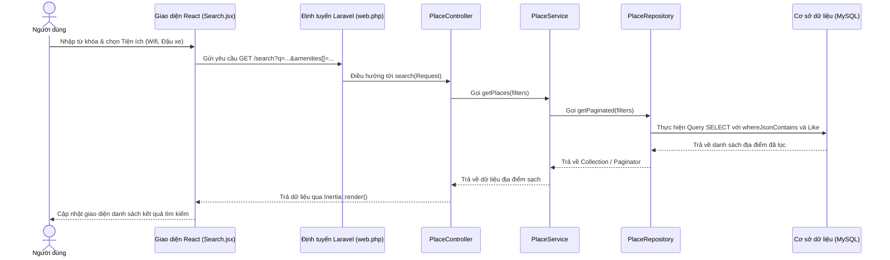

# 🗺️ KhamPhaDD - Cẩm Nang Chi Tiết Về Cấu Trúc File & Thư Mục

Tài liệu này cung cấp cái nhìn toàn diện về nhiệm vụ, vai trò và cách thức hoạt động của từng thư mục, file mã nguồn trong dự án **KhamPhaDD** (Khám Phá Địa Điểm & Lên Lịch Trình).

---

## 📂 Sơ Đồ Cấu Trúc Thư Mục Tổng Quan

Dưới đây là cây thư mục các phần quan trọng nhất của dự án:

```text
KhamPhaDD/
├── app/                        # Mã nguồn Backend (PHP / Laravel)
│   ├── Console/                # Cấu hình lệnh console/cronjob
│   ├── Http/
│   │   ├── Controllers/        # Bộ điều khiển điều phối dữ liệu (Inertia/API)
│   │   ├── Middleware/         # Bộ lọc HTTP Request (Xác thực, Phân quyền...)
│   │   └── Requests/           # Quản lý Validate form dữ liệu gửi lên
│   ├── Models/                 # Các thực thể cơ sở dữ liệu (Eloquent Models)
│   ├── Repositories/           # Tầng kết nối database (Repository Pattern)
│   └── Services/               # Tầng xử lý logic nghiệp vụ chính (Business Logic)
├── bootstrap/                  # Khởi chạy ứng dụng Laravel
├── config/                     # File cấu hình hệ thống (app, database, cache...)
├── database/                   # Quản lý cơ sở dữ liệu
│   ├── data/                   # Chứa dữ liệu JSON thô thu thập từ Google Maps
│   ├── migrations/             # Lịch sử thay đổi cấu trúc bảng database
│   └── seeders/                # File nạp dữ liệu mẫu/thực tế vào database
├── postman/                    # File Import kiểm thử API trên Postman
├── public/                     # Thư mục tài nguyên tĩnh (css, js đã build, ảnh tải lên)
├── resources/                  # Mã nguồn Frontend (React / JSX / Tailwind)
│   ├── css/                    # File CSS cấu hình Tailwind
│   ├── js/                     # Code React JS chính
│   │   ├── Components/         # Các thành phần giao diện dùng chung (Button, Card...)
│   │   ├── Layouts/            # Các khung giao diện chung (Admin, Guest, App)
│   │   ├── lib/                # Thư viện tiện ích, helpers
│   │   └── Pages/              # Các trang giao diện chính (Trips, Places, Admin...)
│   └── views/                  # File HTML chứa ứng dụng chính (app.blade.php)
├── routes/                     # Định tuyến URL (web, api, auth...)
├── tests/                      # Bộ kiểm thử tự động (Unit & Feature Tests)
└── [Root Scripts]              # Các script PHP tiện ích hỗ trợ thu thập và nạp dữ liệu nhanh
```

---

## 🛠️ Chi Tiết Nhiệm Vụ Từng File

### 1. 🗄️ Tầng Dữ Liệu (Eloquent Models - `app/Models/`)
Mỗi Model đại diện cho một bảng trong Cơ sở dữ liệu và quản lý các mối quan hệ (Relations) giữa chúng:

| Tên File | Nhiệm Vụ | Mối Quan Hệ Chính |
| :--- | :--- | :--- |
| **`User.php`** | Đại diện cho người dùng hệ thống. Quản lý thông tin tài khoản, avatar, phân quyền (`role`: admin/user) và hỗ trợ lưu thông tin mạng xã hội. | Có nhiều `Trip`, `Review`, `Favorite`, `Qa`. |
| **`Place.php`** | Thực thể địa điểm (quán cafe, điểm check-in, khách sạn...). Quản lý tên, slug, tọa độ (`latitude`, `longitude`), mô tả, danh sách ảnh (`gallery`), danh mục (`category_ids` & `category_id`), xếp hạng trung bình (`avg_rating`), lượt xem (`view_count`), tiện ích (`amenities`), giờ mở cửa, điện thoại, v.v. | Thuộc về `City`, `Category`. Có nhiều `Review`, `Favorite`. |
| **`Category.php`** | Nhóm/danh mục của địa điểm (Ví dụ: Cà phê, Ăn vặt, Khách sạn, Check-in...). Lưu biểu tượng (`icon`) và mô tả ngắn. | Có nhiều `Place`. |
| **`City.php`** | Tỉnh/thành phố (Ví dụ: Vĩnh Long, TP. Hồ Chí Minh...). | Có nhiều `Place`. |
| **`Trip.php`** | Lịch trình chuyến đi do người dùng tạo. Quản lý tiêu đề, ngày đi/về, giờ xuất phát/trở về, ngân sách, số lượng thành viên, ảnh bìa, trạng thái (`planned`/`completed`) và chế độ công khai (`is_public`). | Thuộc về `User` (chủ chuyến đi). Có nhiều `TripPlace` (địa điểm trong chuyến đi). |
| **`TripPlace.php`** | Thực thể trung gian lưu thông tin địa điểm được thêm vào chuyến đi, bao gồm: Ngày thứ mấy (`day_number`), thứ tự đi (`order`), giờ ghé thăm (`visit_time`), thời gian ở lại (`duration_minutes`) và ghi chú (`note`). | Thuộc về `Trip` và `Place`. |
| **`Review.php`** | Đánh giá địa điểm của người dùng. Gồm số sao (`rating` từ 1-5) và nội dung bình luận (`comment`). | Thuộc về `User` và `Place`. |
| **`Favorite.php`** | Lưu thông tin các địa điểm yêu thích (bookmark) của từng người dùng. | Thuộc về `User` và `Place`. |
| **`Qa.php`** | Hỏi và đáp tại các địa điểm. Lưu câu hỏi gốc, câu trả lời (`parent_id`) và số lượt thích (`likes`). | Thuộc về `User`, `Place`. Có nhiều phản hồi (`answers`). |

---

### 2. ⚡ Tầng Bộ Điều Khiển (Controllers - `app/Http/Controllers/`)
Nơi tiếp nhận Request từ giao diện React (Frontend), gọi các Service xử lý và trả về dữ liệu/giao diện qua Inertia.js:

*   **Giao Diện Người Dùng Công Cộng (Public & User Auth):**
    *   **`PlaceController.php`** (Lớn nhất):
        *   `home()`: Trả về trang chủ với địa điểm nổi bật, địa điểm mới và danh mục.
        *   `search()`: Xử lý tìm kiếm nâng cao với bộ lọc đa chiều (rating, thành phố, tiện ích, khoảng cách).
        *   `show()`: Hiển thị chi tiết địa điểm, tăng lượt xem (`view_count`), lấy các địa điểm tương tự và danh sách câu hỏi Q&A.
        *   `map()`: Trả về dữ liệu bản đồ tương tác hiển thị tọa độ các địa điểm.
        *   `autocomplete()`: API trả về kết quả gợi ý nhanh (typeahead) khi người dùng gõ từ khóa.
        *   `storeDiscovery()`: Nhận và xử lý ảnh (bìa/gallery) khi người dùng (hoặc admin) đề xuất địa điểm mới.
    *   **`TripController.php`**: Xử lý việc tạo lịch trình (`store`), xem lịch trình (`show`), sửa đổi thông tin chung (`update`), kéo thả sắp xếp thứ tự các điểm đến (`reorderPlaces`), thêm/xóa điểm đến khỏi chuyến đi (`addPlace`, `removePlace`), cập nhật mốc giờ (`updatePlaceTime`).
    *   **`ReviewController.php`**: Điều phối tạo, sửa, xóa các đánh giá sao của người dùng thông qua `ReviewService`.
    *   **`QaController.php`**: Xử lý gửi câu hỏi, câu trả lời và tăng lượt like của các thảo luận.
    *   **`FavoriteController.php`**: Toggle (thêm/xóa) địa điểm vào danh sách yêu thích của tài khoản hiện tại.
    *   **`ProfileController.php`**: Cập nhật thông tin cá nhân và thay đổi mật khẩu người dùng.
    *   **`ChatbotController.php`**: Nhận tin nhắn từ ô chat của người dùng, phân tích ý định (Intent Recognition) xem người dùng muốn tìm kiếm quán ăn/cafe ở khu vực nào, muốn xem bản đồ hay tạo chuyến đi. Sau đó, truy vấn địa điểm phù hợp trong DB và trả về tin nhắn cùng danh sách đề xuất dạng JSON cho chatbot.

*   **Giao Diện Quản Trị Viên (Admin - `Controllers/Admin/`):**
    *   **`AdminPlaceController.php`**: Quản lý CRUD các địa điểm cho Admin, phê duyệt và cập nhật tọa độ bản đồ.
    *   **`AdminCategoryController.php`**: Quản lý danh mục (thêm biểu tượng mới, sửa mô tả, xóa danh mục).

*   **Tích Hợp API (`Controllers/Api/V1/`):**
    *   **`PlaceApiController.php`**: Trả về dữ liệu thô (JSON) phục vụ các hệ thống khác muốn tích hợp lấy danh sách địa điểm và danh mục của KhamPhaDD.

---

### 3. 🧠 Tầng Nghiệp Vụ & Kết Nối DB (Services & Repositories)
Giúp mã nguồn sạch sẽ, không bị lặp lại logic và dễ dàng viết kiểm thử tự động (Unit test).

*   **`app/Repositories/Contracts/PlaceRepositoryInterface.php`**: Định nghĩa khuôn mẫu các phương thức truy vấn địa điểm (Map, Autocomplete, Recommendation).
*   **`app/Repositories/PlaceRepository.php`**: Thực thi các câu lệnh Eloquent SQL phức tạp như lọc theo mảng `category_ids` (JSON), lọc tiện ích (`amenities`), tính toán điểm số xếp hạng để gợi ý.
*   **`app/Services/`**:
    *   **`PlaceService.php`**: Quản lý logic nghiệp vụ về địa điểm (lấy danh sách có phân trang, tăng view có chống spam, gợi ý các nơi tương đồng).
    *   **`RecommendationService.php`**: Áp dụng công thức tính điểm ưu tiên: `score = (view_count * 0.3) + (avg_rating * 20 * 0.7)`. Tự động lưu cache để tăng tốc độ tải trang, tự động gợi ý theo nhóm danh mục mà người dùng đã từng bấm yêu thích (Favorites).
    *   **`ReviewService.php`**: Xử lý tạo, cập nhật, xóa đánh giá. **Đặc biệt:** Kích hoạt tính toán lại điểm đánh giá trung bình (`avg_rating`) của địa điểm bất đồng bộ nhằm tối ưu hiệu năng.
    *   **`FavoriteService.php`**: Kiểm tra trạng thái yêu thích của địa điểm đối với người dùng đang truy cập.

---

### 4. 🎨 Giao Diện Người Dùng (Frontend - `resources/js/`)
Ứng dụng sử dụng React và Inertia.js để render giao diện đơn trang (SPA) cực kỳ mượt mà.

#### A. Layouts (Khung giao diện chính - `Layouts/`):
*   **`AppLayout.jsx`**: Layout chính dành cho người dùng đã đăng nhập hoặc khách ghé thăm. Chứa thanh điều hướng (Navbar), thanh tìm kiếm nhanh, chân trang (Footer) và tích hợp sẵn bóng bong ô Chatbot AI nổi ở góc màn hình.
*   **`AdminLayout.jsx`**: Layout dành riêng cho trang quản trị, có menu bên trái (Sidebar) để chuyển đổi nhanh giữa quản lý Địa điểm và Danh mục.
*   **`GuestLayout.jsx`**: Layout tối giản dành cho các trang Auth (Đăng nhập, Đăng ký, Quên mật khẩu).

#### B. Các Thành Phần Giao Diện (Components - `Components/`):
*   **`Chatbot.jsx`**: Hộp thoại chat AI. Giao tiếp với `ChatbotController` để hiển thị tin nhắn, gợi ý các nút bấm hành động nhanh (Mở bản đồ, Xem chi tiết, Đăng nhập...) và hiển thị slide các thẻ địa điểm trực quan ngay trong khu vực chat.
*   **`PlaceCard.jsx`**: Thẻ hiển thị địa điểm thu nhỏ dùng ở trang chủ, tìm kiếm. Hiển thị ảnh bìa, tên, điểm rating, tiện ích nhanh, nút bookmark yêu thích.
*   **`Button.jsx`**: Thành phần nút bấm được chuẩn hóa màu sắc và hiệu ứng hover.

#### C. Các Trang Giao Diện (Pages - `Pages/`):
*   **Trang Chung:**
    *   **`Home.jsx`**: Trang chủ ứng dụng với banner lớn, ô tìm kiếm nhanh, danh mục trượt ngang, danh sách gợi ý nổi bật và địa điểm mới cập nhật.
    *   **`Dashboard.jsx`**: Bảng điều khiển cá nhân, hiển thị tóm tắt các chuyến đi sắp tới, danh sách yêu thích và các hành động nhanh.

*   **Module Địa Điểm (`Pages/Places/`):**
    *   **`Search.jsx`**: Trang tìm kiếm bộ lọc nâng cao. Cho phép tích hợp hiển thị cột bên trái là danh sách tìm kiếm, lọc theo Tiện ích, Xếp hạng, Thành phố, cột bên phải hoặc bản đồ nhỏ tùy chỉnh.
    *   **`Show.jsx`**: Trang chi tiết một địa điểm. Hiển thị thông tin liên hệ, giờ hoạt động, mô tả, bộ sưu tập ảnh (Gallery), danh sách các tiện ích (Wifi, Điều hòa, Chỗ đậu xe...), bản đồ mini vị trí địa điểm, khu vực thảo luận Q&A (có like, trả lời bình luận) và mục đánh giá sao.
    *   **`Map.jsx`**: Bản đồ tương tác lớn sử dụng Leaflet. Gom cụm các điểm đến lại (`MarkerClusterer`), cho phép click xem nhanh thông tin địa điểm (Popup) và có thanh lọc theo danh mục nhanh.
    *   **`Favorites.jsx`**: Danh sách tất cả địa điểm người dùng đã đánh dấu yêu thích.

*   **Module Lên Lịch Trình (`Pages/Trips/`):**
    *   **`Index.jsx`**: Danh sách chuyến đi cá nhân. Cho phép tạo nhanh chuyến đi mới kèm chọn bìa và mời thành viên.
    *   **`CreateForm.jsx`**: Trình tạo chuyến đi trực quan, hỗ trợ chọn địa điểm từ bản đồ/danh sách gợi ý.
    *   **`Show.jsx`**: Trang xem lịch trình chi tiết theo từng ngày (Ngày 1, Ngày 2...), hiển thị danh sách thành viên tham gia chuyến đi.
    *   **`Edit.jsx`** (Quan trọng): Trang chỉnh sửa lịch trình nâng cao. Tích hợp bản đồ Leaflet hiển thị đường đi nối các điểm, kết hợp kéo thả (`@dnd-kit`) để thay đổi thứ tự điểm đến hoặc chuyển điểm đến từ Ngày 1 sang Ngày 2 một cách mượt mà.
    *   **`PlacePicker.jsx`**: Hộp thoại tìm kiếm và chọn nhanh địa điểm để thêm vào chuyến đi trong trình thiết kế lịch trình.

---

### 5. 🗃️ Cơ Sở Dữ Liệu & Định Tuyến (Database & Routes)
*   **`database/migrations/`**: Chứa 29 file di chuyển cấu trúc database. Thiết lập các liên kết khóa ngoại (`foreignKey`), lập chỉ mục (`index`) tọa độ, tối ưu hóa tìm kiếm văn bản full-text.
*   **`database/seeders/`**:
    *   `DatabaseSeeder.php`: Điểm kích hoạt nạp dữ liệu mẫu.
    *   `CitySeeder.php` & `CategorySeeder.php`: Tạo dữ liệu nền cho các tỉnh thành và danh mục dịch vụ.
    *   `GooglePlacesSeeder.php`: Nạp dữ liệu thực tế thu thập được từ Google Maps (file JSON) vào bảng `places`.
    *   `HcmCafeCheckinSeeder.php`: Nạp dữ liệu đặc thù về các quán cà phê sống ảo và địa điểm check-in tại TP.HCM.
    *   `ReviewSeeder.php`: Tạo các đánh giá mẫu ngẫu nhiên để phục vụ hiển thị ban đầu.
*   **`routes/`**:
    *   **`web.php`**: Quản lý toàn bộ định tuyến hiển thị trang giao diện Inertia (Home, Search, Map, Trips, Reviews, Q&A).
    *   **`auth.php`**: Chứa các route xác thực (Đăng nhập, Đăng ký, Đăng xuất, Khôi phục mật khẩu, Xác minh email) sử dụng Laravel Breeze.
    *   **`api.php`**: Định tuyến API không trạng thái (stateless) cho bên thứ ba hoặc gọi không đồng bộ.

---

### 6. 🛠️ Các Script Tiện Ích Ở Thư Mục Gốc (Root Utilities)
Các file script độc lập dùng để chạy bằng dòng lệnh (`php <file_name>.php`) phục vụ quá trình bảo trì dữ liệu:

*   **`crawl_cities.php`**: Kết nối với API của Apify (Google Maps Scraper Actor) để tự động cào 10 địa điểm nổi bật nhất của mỗi thành phố trong database, sau đó gộp kết quả vào file `database/data/places_raw.json`.
*   **`seed_snacks.php`**: Script nạp nhanh các địa điểm thuộc danh mục "Ăn vặt" tại Vĩnh Long và TP.HCM trực tiếp vào cơ sở dữ liệu để chạy thử nghiệm.
*   **`merge_places.php`**: Gộp các file dữ liệu địa điểm chia nhỏ (`places_part1.json`, `places_part2.json`, `places_part3.json`) thành một file tổng thể duy nhất `places_raw.json`.
*   **`city_dist.php`**: Truy vấn nhanh và in ra màn hình thống kê số lượng địa điểm hiện có của từng tỉnh thành trong database để kiểm tra phân bổ dữ liệu.
*   **`get_cafes_in_db.php`**: Tìm nhanh các địa điểm thuộc danh mục quán cà phê và in ra tọa độ cũng như link Google Maps để đối chiếu dữ liệu bản đồ.
*   **`debug_filter.php`**: Script chạy thử các câu truy vấn lọc địa điểm để debug lỗi kết quả trả về không khớp trên giao diện.

---

## 📈 Sơ Đồ Luồng Hoạt Động (Tìm kiếm địa điểm)

Dưới đây là sơ đồ minh họa luồng hoạt động khi người dùng thực hiện tìm kiếm địa điểm:



---

> [!NOTE]
> Để cập nhật cấu trúc dữ liệu mới, hãy thực hiện qua file Migration trong `database/migrations/` thay vì chỉnh sửa trực tiếp trên cơ sở dữ liệu để đảm bảo tính đồng bộ của dự án.
